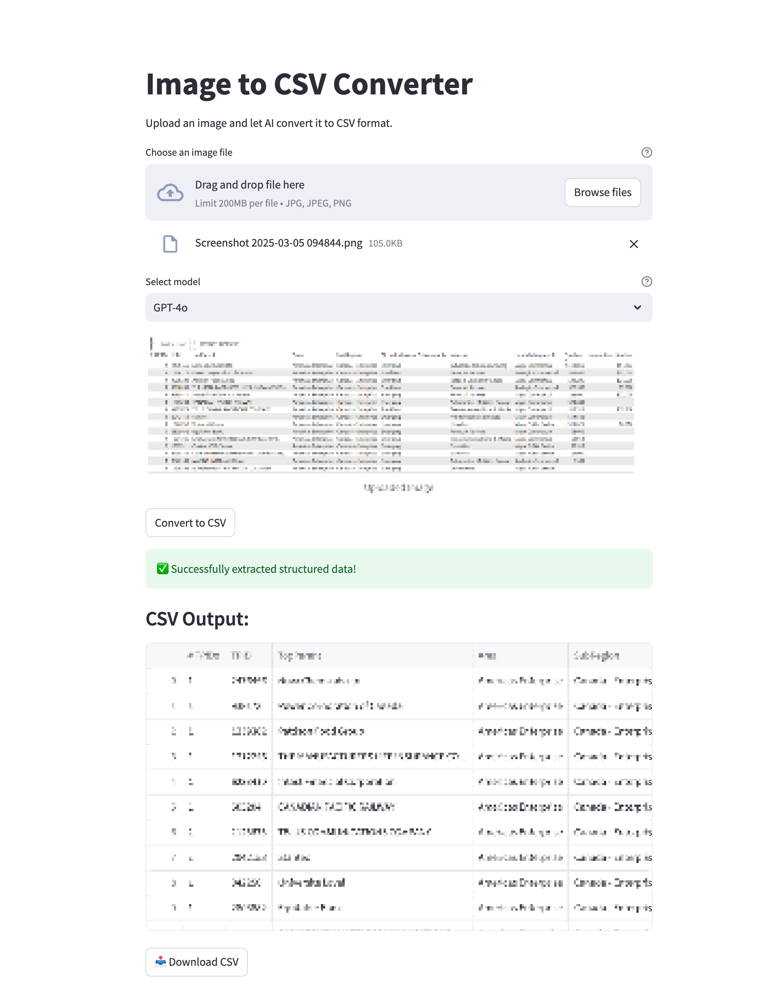

# 📋 Image to CSV Converter

A Streamlit application that leverages Azure OpenAI's vision capabilities to convert images containing tables or structured data into CSV format for easy use in spreadsheets and data analysis.



## ✨ Features

- 🖼️ Upload any image containing tabular data or structured text
- 🤖 Process with GPT-4o or other vision models
- 📊 Extract structured data with high accuracy using advanced AI
- 📥 Download results as ready-to-use CSV files
- 🔄 Fallback processing options if initial extraction fails
- 🔒 Secure authentication system for access control

## 🚀 Getting Started

### Prerequisites

- Python 3.8 or higher
- Azure OpenAI API access with GPT-4o capability
- Azure subscription with vision features enabled
- Authentication service (optional)

### Installation

1. Clone the repository:

   ```bash
   git clone https://github.com/yourusername/image_to_csv.git
   cd image_to_csv
   ```

2. Create and activate a virtual environment:

   ```bash
   python -m venv venv
   source venv/bin/activate  # On Windows, use: venv\Scripts\activate
   ```

3. Install the required dependencies:

   ```bash
   pip install -r requirements.txt
   ```

4. Set up your `.env` file with your Azure OpenAI credentials:

   ```bash
   # Copy the sample environment file and edit it with your credentials
   cp .env.sample .env
   # Now edit the .env file with your preferred editor
   nano .env  # or use any text editor you prefer
   ```

### Running the Application

Run the Streamlit application:

```bash
streamlit run app.py
```

Open your web browser to <http://localhost:8501> to use the application.

## 📖 Usage

1. **Upload an Image**: Click the upload button to select an image file containing a table or structured data.

2. **Select Model**: Choose between GPT-4o (higher accuracy) or [add other vision capable models].

3. **Convert**: Click the "Convert to CSV" button to start the extraction process.

4. **Review and Download**: After processing, review the extracted data in the interactive table view, then download the CSV file using the download button.

## 🔐 Authentication

The application includes a flexible authentication system that:

1. Secures access to your application using an external authentication service
2. Automatically detects if running locally or in a deployed environment
3. Properly handles login/logout flows and session management
4. Supports both authenticated and non-authenticated modes

### Configuring Authentication

To enable authentication:

1. Set `VITE_AUTH_ENABLED=true` in your `.env` file
2. Configure `VITE_AUTH_URL` to point to your authentication service
3. Optionally set `APP_NAME` to customize your application name in the auth service

To disable authentication:

1. Set `VITE_AUTH_ENABLED=false` in your `.env` file

The authentication module will automatically determine your frontend URL based on the environment, but you can explicitly set it using `FRONTEND_URL` if needed.

## 🧰 How It Works

The application uses a multi-stage approach to extract data:

1. First, it attempts to use the OpenAI structured outputs feature to extract data in a precisely defined format.

2. If that fails, it falls back to a standard completion approach with specialized CSV parsing.

3. The resulting data is presented in an interactive table and made available for download as a CSV file.

## 🚀 Deployment

This application can be deployed to Azure using the provided `deploy.sh` script.

### Deployment Prerequisites

1. Ensure your `.env` file includes all the Azure deployment configuration values shown in `.env.sample`:

   ``` plaintext
   # Azure Deployment Configuration
   AZURE_RESOURCE_GROUP=your-resource-group
   AZURE_LOCATION=your-preferred-region
   AZURE_ACR_NAME=your-container-registry
   AZURE_APP_SERVICE_PLAN=your-app-service-plan
   AZURE_KEY_VAULT=your-key-vault
   AZURE_LOG_ANALYTICS=your-log-analytics
   AZURE_APP_SERVICE_SKU=P1V3
   AZURE_DOCKER_IMAGE_TAG=latest
   
   # Authentication Settings
   VITE_AUTH_URL=https://your-auth-service-url.com
   VITE_AUTH_ENABLED=true|false
   APP_NAME=your-app-name  # Optional
   ```

2. Make sure you have the Azure CLI installed and have logged in:

   ```bash
   az login
   ```

### Deploying the Application

Run the deployment script:

```bash
./deploy.sh image2csv app.py
```

- The first parameter (`image2csv`) is the name of your application
- The second parameter (`app.py`) is the entry file for your Streamlit app

After deployment completes, your app will be available at:

``` plaintext
https://app-<yourappname>.azurewebsites.net
```

## 📁 Project Structure

``` plaintext
image_to_csv/
├── app.py               # Main Streamlit application
├── auth.py              # Authentication module
├── utils.py             # Utility functions for OpenAI client setup
├── requirements.txt     # Project dependencies
├── deploy.sh            # Deployment script for Azure
├── Dockerfile           # Container definition for deployment
├── .env                 # Environment variables (not tracked in git)
├── .env.sample          # Sample environment variables template
├── README.md            # Project documentation
└── docs/                # Documentation assets
```

## 📄 License

This project is licensed under the [MIT License](LICENSE)

## 🙏 Acknowledgements

- [Azure OpenAI](https://azure.microsoft.com/en-us/products/ai-services/openai-service/) for providing the powerful AI models
- [Streamlit](https://streamlit.io/) for the simple web application framework
- [Pandas](https://pandas.pydata.org/) for data handling capabilities
